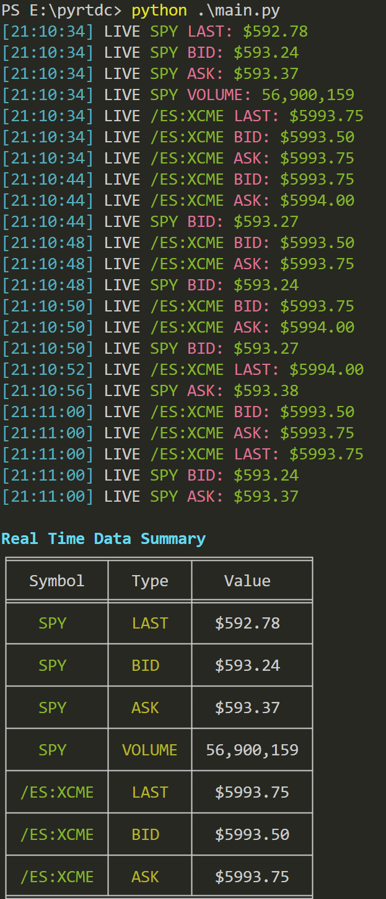

# Real-Time Data Client (RTDClient)

This project is a Real-Time Data Client for the ThinkorSwim Excel RTD Server. It provides a synchronous interface to handle real-time market data subscriptions and updates.


## Installation

Install the required dependencies:
    ```
    pip install -r requirements.txt
    ```

## Usage

To run the RTD client, execute 
```
python main.py
```
The client will initialize, subscribe to the specified quote types and symbols, and start receiving real-time updates & displayed in the console. For more detailed output the file_level can be set to DEBUG in config.yaml In Production this can be changed to INFO (default) or NONE

Thinkorswim needs to be running to receive updates. In some installations, TOS needs to be started as an admin user as this is necessary to register the RTD prog interfaces in the windows registry. 



## Scaling

This is a greatly simplified client. From tests, each client can handle roughly 300 topics reliably, but beyond that, a .NET exception is thrown. This is true for clients implemented in other languages as well.

In order to scale and improve performance, the project becomes far more complex and is not a candidate for general release. However, I can share some approaches that scale and run quite well:

- **Async/asyncio libraries**: Use these for everything, including all the methods for `IRtdServer` and `IRTDUpdateEvent` interfaces. `UpdateNotify` and `Disconnect` are synchronous methods inherently per server-side design, but warnings can be suppressed, although it's not an elegant design. In an async implementation, the refreshes can be done manually every n seconds without having to deal with COM message pumping/UpdateNotify. Even if it is not the most elegant way, it is well worth it for performance improvements at a larger scale.

- **TOS COM server**: Works on a Single Threaded Apartment model.

- **Memory mapping**: While memory mapping works great for topic management in the simple thin client, to scale up, it is much better to utilize caching & pub/sub architecture like Redis or zmq in conjunction with memory-efficient DBs like LMDB. This is the preferred solution. SQLite is probably another good candidate, but the former stack can easily scale up to 100K topics on the same host for low latency refreshes and data warehousing. Each client utilizes 50/60MB during market hours, so overall capacity is also constrained by RAM in such cases. Excel is really awesome in that sense, although enhanced clients can surpass Excel in performance.

- **Multi-client setups**: I also recommend monitoring the overall space with Prometheus and Grafana.

- **Python?**: C++ is generally a good choice and is probably the fastest. The server-side Thinkorswim RTD is C/C++ based. C# supports native COM interop and is the preferred choice for COM, but I noticed that there have been no publicly available clients in other languages, especially Python, where implementations are more difficult as there is very little literature around the subject. The last working client was almost two decades ago.

Also, I wanted to mention that `comtypes` is just one approach. `ctypes` and `win32com` also work great, but the syntax and procedure to build COM objects and invoke the COM operations are slightly different for each library.  

- **Data Warehouse**: ClickHouse preferred


## Useful Reading

- [Creating a RealTimeData Server in Excel](https://asp-blogs.azurewebsites.net/kennykerr/Rtd3)
- [Create a RealTimeData Server in Excel](https://learn.microsoft.com/en-us/previous-versions/office/troubleshoot/office-developer/create-realtimedata-server-in-excel#more-information)
- [Excel RTD Server](https://github.com/SublimeText/Pywin32/blob/master/lib/x32/win32com/demos/excelRTDServer.py)

## Applications built/developed using pyrtdc

If you would like to share your applications built on pyrtdc, please reach out/open PRs. Contributions and development are encouraged and appreciated. 

- [Tos Streamlit Dashboard](https://github.com/2187Nick/tos-streamlit-dashboard/)
- [Tos Market Depth RTD](https://github.com/2187Nick/tos-market-depth-rtd/tree/main)

## License

This project is licensed under the MIT License
